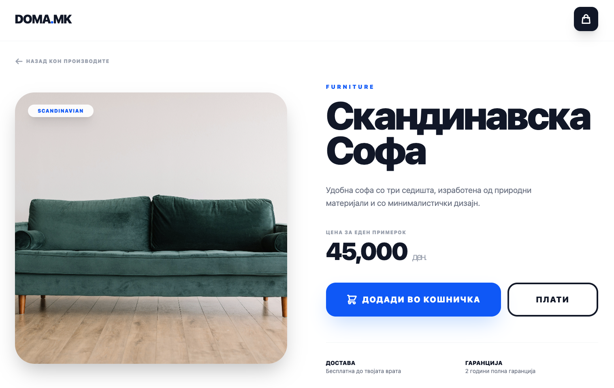
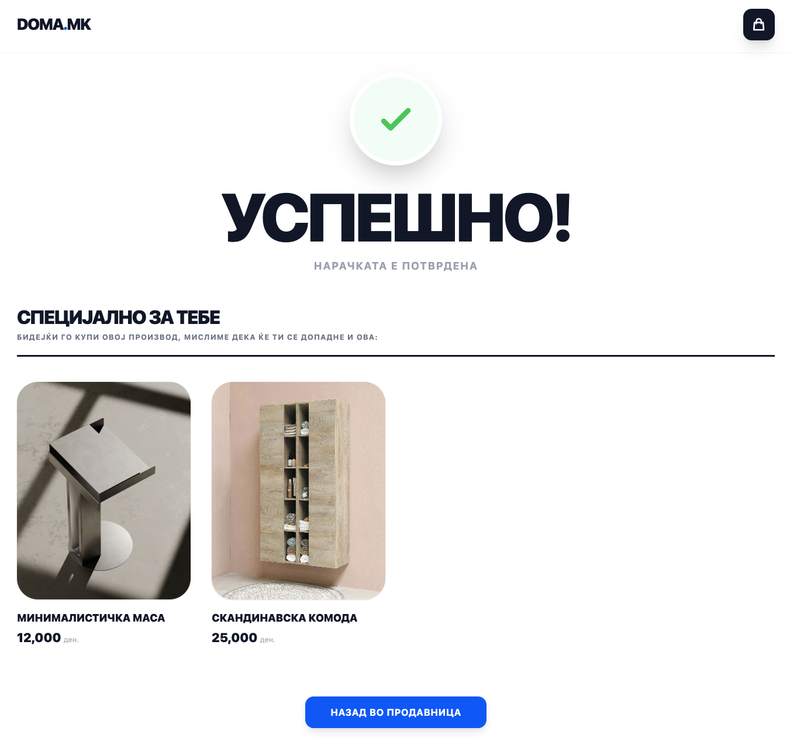

# 🛋️ DOMA.MK - Модерна Продавница за Мебел

**DOMA.MK** е фул-стак веб апликација за продажба на мебел, изградена со цел да понуди минималистички дизајн, брза навигација и паметно корисничко искуство. Проектот користи React за фронтенд и Spring Boot за бекенд.

---

## 🚀 Главни Страници & Функционалности

- **🏠 Product Page:** Целосен каталог на мебел со висок квалитет на приказ.
- **✨ Product Details:** Детални информации за производите и преглед на карактеристики.
- **🛒 Shopping Cart:** Менаџирање со производи, промена на количина и пресметка во реално време.
- **💳 Checkout:** Безбедна форма за внес на податоци за достава и процесирање на плаќање.
- **✅ Success & Recommendations:** Потврда за успешна нарачка со паметен систем за препораки базиран на купениот производ.

---

## 🖼️ Преглед (Screenshots)

<table width="100%">
  <tr>
    <td width="50%" align="center">
      <b>🏠 Product Page</b>
      
    </td>
    <td width="50%" align="center">
      <b>✨ Product Details</b>
      
    </td>
  </tr>
  <tr>
    <td width="50%" align="center">
      <b>🛒 Shopping Cart</b>
      
    </td>
    <td width="50%" align="center">
      <b>💳 Checkout & Payment</b>
      
    </td>
  </tr>
</table>

<p align="center">
  <b>🎉 Success & Recommendations Section</b><br>
  
</p>

---

## 🛠️ Технолошки Стек

**Frontend:**
- React.js (Vite)
- Tailwind CSS (За модерен и брз UI)
- React Router Dom (Навигација)
- Axios (API повици)

**Backend:**
- Java Spring Boot
- Spring Data JPA
- PostgreSQL / H2 Database
- Stripe API (Процесирање на плаќања)

---

## 📦 Структура на проектот

```text
doma_project/
├── frontend/     # React апликација
│   ├── src/
│   ├── public/
│   └── package.json
└── backend/      # Spring Boot REST API
    ├── src/
    ├── pom.xml
    └── application.properties
